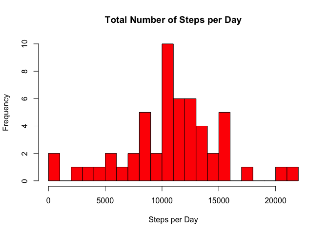
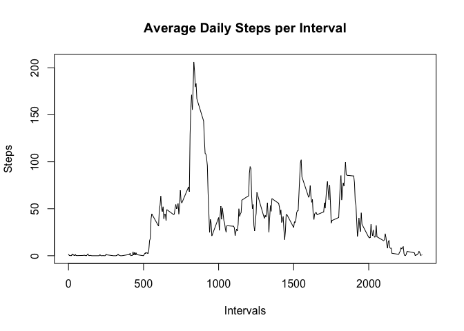
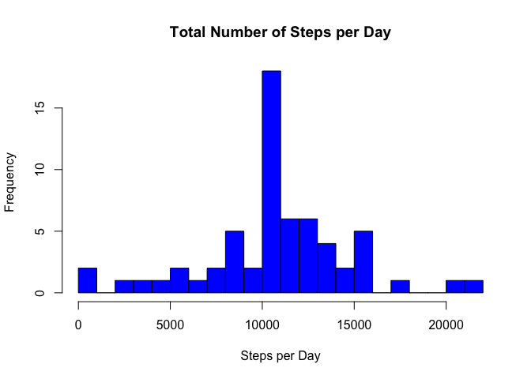

# Reproducible Research: Peer Assessment 1


## Loading and preprocessing the data
The data is stored in a zip file, which needs to be unzipped and stored in a variable

```r
unzip(zipfile="activity.zip")
activity <- read.csv("activity.csv")
```

We take a look at the structure of the data, the date is stored as a factor, we need to convert it into a date format

```r
str(activity)
```

```
## 'data.frame':	17568 obs. of  3 variables:
##  $ steps   : int  NA NA NA NA NA NA NA NA NA NA ...
##  $ date    : Factor w/ 61 levels "2012-10-01","2012-10-02",..: 1 1 1 1 1 1 1 1 1 1 ...
##  $ interval: int  0 5 10 15 20 25 30 35 40 45 ...
```

```r
dates <- activity$date
dates <- as.Date(dates)
```

It looks like there are some NA values in the dataset in the steps column, lets see how many of these values are there

```r
sum(is.na(activity$steps))
```

```
## [1] 2304
```

Lets create a clone of the data with the NA values removed for now:

```r
activitydata <- activity[which(!is.na(activity$steps)),]
```


## What is mean total number of steps taken per day?
For now we can ignore the missing values in the data.  
First we need to calculate the total number of steps taken per day

```r
stepsperday <- aggregate(steps~date, activitydata, sum)
```

Then we make a histogram of the total number of steps taken each day

```r
hist(stepsperday$steps,breaks = 20, main = "Total Number of Steps per Day", xlab = "Steps per Day", col = "red")
```

<!-- -->

Calculate and report the mean and median of the total number of steps taken per day

```r
mean(stepsperday$steps)
```

```
## [1] 10766.19
```

```r
median(stepsperday$steps)
```

```
## [1] 10765
```


## What is the average daily activity pattern?
In order to identify the average daily pattern, we can make a time series plot (i.e. 𝚝𝚢𝚙𝚎 = "𝚕") of the 5-minute interval (x-axis) and the average number of steps taken, averaged across all days (y-axis). First we need to calculate the average steps taken for each time interval

```r
stepsperinterval <- aggregate(steps~interval, activitydata, mean)
```

We can then plot the data in a time series plot

```r
plot(stepsperinterval$interval,stepsperinterval$steps, type = "l", xlab = "Intervals", ylab="Steps", main = "Average Daily Steps per Interval")
```

<!-- -->


Which 5-minute interval, on average across all the days in the dataset, contains the maximum number of steps?

```r
maxinterval <- stepsperinterval[which.max(stepsperinterval$steps),1]
stepsperinterval[stepsperinterval$interval==maxinterval,]
```

```
##     interval    steps
## 104      835 206.1698
```
The interval 835 has the most number of steps on average across all days


## Imputing missing values
Lets recall the total number of missing values that we calculated earlier

```r
sum(is.na(activity$steps))
```

```
## [1] 2304
```

We need to devise a strategy for filling in all of the missing values in the dataset. The strategy does not need to be sophisticated. For example, the mean/median for that day, or the mean for that 5-minute interval, etc. could be used. 
In order to fill the missing values we will be using the mean value of that 5-minute interval

```r
# Creating a new dataset that is the clone ofthe original
activityNew <- activity 

# Calculating the mean steps of each interval
meansteps <- tapply(activityNew$steps,activityNew$interval,mean, na.rm = T) 
```

Create a new dataset that is equal to the original dataset but with the missing data filled in

```r
# Using the mean steps to fill in missing data 
newSteps <- ifelse(is.na(activityNew$steps),meansteps,activityNew$steps)
# Replacing the old steps column with the new steps(with filled in data)
activityNew$steps <- newSteps 
```
There is no missing data in the dataset now

```r
sum(is.na(activityNew))
```

```
## [1] 0
```

Make a histogram of the total number of steps taken each day and Calculate and report the mean and median total number of steps taken per day. 

```r
updatedsteps <- aggregate(steps~dates, activityNew,sum)
updatedsteps <- aggregate(steps~dates, activityNew, sum)
hist(updatedsteps$steps, breaks=20, main = "Total Number of Steps per Day", xlab = "Steps per Day", col = "blue")
```

<!-- -->

```r
mean(updatedsteps$steps)
```

```
## [1] 10766.19
```

```r
median(updatedsteps$steps)
```

```
## [1] 10766.19
```
Do these values differ from the estimates from the first part of the assignment? What is the impact of imputing missing data on the estimates of the total daily number of steps?

The values differ a little from the the initial plot as the missing values were assumed as 0, but have been replaced with the mean steps of each interval. As a result, the values are higher.
The mean and the median are also equal to each other.


## Are there differences in activity patterns between weekdays and weekends?
In order to discover if there are differences in activity patterns between weekdays and weekends we need to first, create a new variable in the dataset with two levels – “weekday” and “weekend” indicating whether a given date is a weekday or weekend day.

```r
activityNew$date <- as.Date(activityNew$date)
activityNew$dayType <- ifelse(weekdays(activityNew$date) %in% c("Saturday","Sunday"),"weekend","weekday")
head(activityNew)
```

```
##       steps       date interval dayType
## 1 1.7169811 2012-10-01        0 weekday
## 2 0.3396226 2012-10-01        5 weekday
## 3 0.1320755 2012-10-01       10 weekday
## 4 0.1509434 2012-10-01       15 weekday
## 5 0.0754717 2012-10-01       20 weekday
## 6 2.0943396 2012-10-01       25 weekday
```

Then we can make a panel plot containing a time series plot (i.e. 𝚝𝚢𝚙𝚎 = "𝚕") of the 5-minute interval (x-axis) and the average number of steps taken, averaged across all weekday days or weekend days (y-axis). 

```r
avgsteps <- aggregate(steps~interval+dayType,activityNew,mean)

library(lattice) #Load the Lattice package
xyplot(avgsteps$steps~avgsteps$interval|avgsteps$dayType,main="Average Steps per Day by Interval",xlab="Interval", ylab="Steps",layout=c(1,2),type = "l")
```

<!-- -->

There is a difference in activity between weekends and weekdays, people are more active earlier on weekdays as compared to weekends. This could be because people wake up earlier to go to work on weekdays, whereas they are more likely to sleep in on weekends and wake up later.
In addition there is a large spike in activity in the mornings on weekdays, whereas peaks are more even and spread out during weekends
